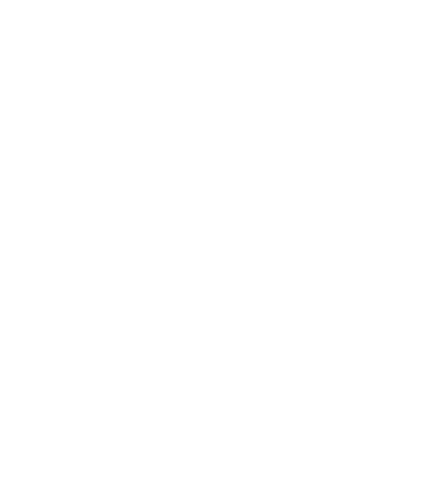

<!-- TODO: [..] Get a j*b. -->

### `libquark[v3]`

Quark is a compact and efficient library designed for building scalable web applications.

<!-- If you're interested in making an application with Quark, check out the [documentation website](https://codeberg.org/pparaxan/Quark/wiki). -->
<!-- ^ Website is no where complete -->

## Features

- **Fast Build Times**: Compiles from scratch in ~6 seconds, faster than other typical projects.
- **Compact**: Lightweight by design, integrates effortlessly with minimal setup.
- **Efficient**: Optimized for runtime performance and smooth execution.
- **Scalable**: Grows with your app, easy to extend as your project evolves.
<!-- - **Easy to Use**: Provides a simple, intuitive API for rapid web development. -->

## License

Quark is licensed under the MIT License. See [LICENSE](./LICENSE) for details.
